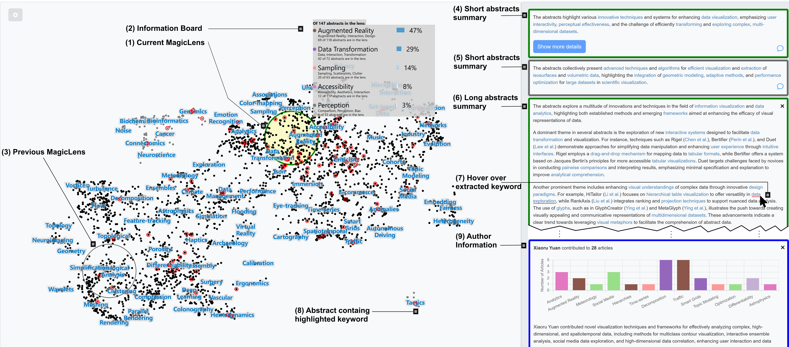

# Overview

This repository contains the demo code for the work ''PromptLenses: Enhancing the Magic of Lenses (for Text Analysis)'' by Satkunarajan et al. [[1]](#ref1).

We introduce an visual-interactive approach to fast analysis of textual data, utilizing a LLM-powered magic lens and a progressive analysis pipeline for the exploration of text data. 

The prototype implementation utilizes OpenAI's [GPT4omini] (https://platform.openai.com/docs/models/o4-mini) via the OpenAI API for the analysis of textual embeddings.

The data is visualized as 2D projections by utilizing [UMAP](https://umap-learn.readthedocs.io/en/latest/) to dimensionality reduce the data.

By applying [spectral clustering](https://scikit-learn.org/stable/modules/generated/sklearn.cluster.SpectralClustering.html) we also provide cluster labels for orientation.

The progressive analysis pipeline comprises three components: **(1)** Precomputation of clusters, **(2)** Short LLM answers and **(3)** extended LLM answers.

The code works with textual inputs and can be utilized out-of-the-box with the 2D-projected IEEE VIS abstracts [[2]](#ref2) found in /app/magic-lens-app/src/assets/datasets. To use custom datasets please refer to the data processing tutorial (*coming soon*). You can find below a a detailed description of how to run the code.

# OpenAI API KEY

**IMPORTANT**: The system requires an OpenAI API key to access GPT4o-mini for the LLM-based processing. You have to add **YOUR OWN** OpenAI API key in the configuration of the tool to be able to use the AI functionality! The amount of tokens consumed by the application and the resulting OpenAI costs highly depend on the intensity of your usage. In app/magic-lens-app you need to create a folder `environment` with a `environment.prod.ts` file that contains the following code: `export const environment={OPENAI_API_KEY: "your_open_api_key"}`.

# Usage

**Prerequisites**
- Node.js installed
- Angular-CLI installed
- OpenAI API key set as described above

**To run the code** 
- navigate into app/magic-lens-app
- type ng serve to start the app
- app is opened on localhost:4200
- explore!

# Demo video

**coming soon**

# References
 [1] J. Satkunarajan et al., "PromptLenses: Improving the Magic of Lenses (for Text Analysis)", in EuroVis 2025 - Short Papers.

 [2] P. Isenberg et al., "Vispubdata.org: A Metadata Collection About IEEE Visualization (VIS) Publications," in IEEE Transactions on Visualization and Computer Graphics

# Special Thanks

This code is based on the Bachelor Thesis of Phillip Wohlfart and his Magic Lens application can be found at https://github.com/PhillipWohlfart/combine-llm-with-magic-lens.
